<h3><code>uros@github ~ $ ./contributions.sh</code></h3>

  

<h3><code>uros@github ~ $ whoami</code></h3>

  

<h3><code>uros@github ~ $ ls ~/shipped</code></h3>

  

<h3><code>uros@github ~ $ contact</code></h3>

[**LinkedIn**](https://linkedin.com/in/urosradojicic) · [**Email**](mailto:urke5432@gmail.com) · Belgrade, Serbia

 

Every image above is an animated SVG generated by
<a href="./scripts">a handful of Python scripts</a> in this repo — no profile-stats
services, no token, no JavaScript. The contribution graph re-scrapes GitHub's
public calendar and redraws itself <a href="./.github/workflows/refresh.yml">every
morning</a>.

